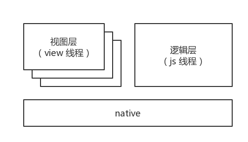
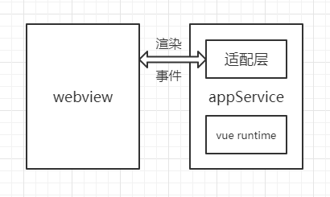
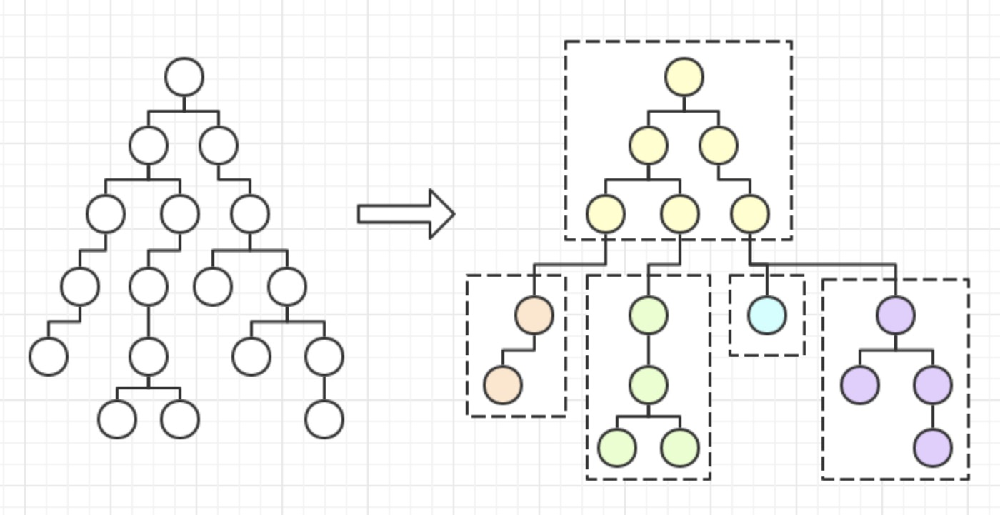

## 原理

### 微信小程序是什么？

微信小程序是一种全新的连接用户与服务的方式，它可以在微信内被便捷地获取和传播，同时具有出色的使用体验。小程序提供了一个简单、高效的应用开发框架和丰富的组件及API，帮助开发者在微信中开发具有原生 APP 体验的服务。

小程序的技术底层依托于 Web 技术，和 Web 端开发相似却又不同。在 Web 中，开发者可以使用浏览器提供的 dom/bom api 来操作渲染内容，同时编写 js 脚本来执行页面逻辑；在小程序中渲染和逻辑则完全分离，开发者可以编写 js 脚本，但是无法直接调用 dom/bom api，渲染和逻辑的交互通过数据和事件来驱动，开发者可以不用在去关心渲染的细节。

如上所述，小程序的底层实现是封闭的，现有的 Web 代码无法直接在小程序环境里运行，对于有多端需求的项目来说代码的维护是一个难题，加一个功能或者改一个样式可能需要改动两套代码。因此，kbone 作为一套解决方案应运而生，用于支持让一个项目可以同时在 Web 端和小程序端被使用。

### 方案设计

方案设计有如下几个前提：

1. 为了更好的复用组件，尽可能完整的支持 Web 端的特性
2. 在小程序端的渲染结果要尽可能接近 Web 端 h5 页面

在前提 1 的限制下，直接将 Web 端组件直接转换成小程序代码的方式不可取，因为这种做法会限制大部分 Web 端特性，而且在一些可实现特性的兼容方面也很难做得完美，所以必须将 Web 端框架（比如 vue、react 等）给完整引进来。这些 Web 端框架底层依赖了小程序里没有的 dom 接口，想要引入 Web 端框架，要么对其底层进行修改，要么提供适配器接口。为了方便开发维护，同时也为了尽可能避免引入难以预料的问题，准备以提供适配器的方式来支持。

适配器可以理解是一棵在 appService 端运行的轻型 dom 树，它提供基础的 dom/bom api。appService 端和 webview 端的交互通过适配器来进行，Web 端框架和业务代码不直接触达和 webview 端的通信接口（如 setData 等接口）。

dom 树本身是没有固定模式可循的，它的层级、dom 节点数量都是不固定的，没有办法用固定的 wxml 将其描述出来，因此这里使用了小程序自定义组件的自引用特性。

自定义组件支持使用自己作为其子节点，也就是说可以用递归引用的方式来构造任意层级、任意节点数量的自定义组件树，所以可以将若干个 dom 节点映射成一个小程序的自定义组件，每一个自定义组件相当于描述出了 dom 树的一部分，然后将这些自定义组件拼接起来就可以描述出一棵完整的 dom 树。

如上图所述，虚线框将一棵 dom 树划分成五棵子树，每棵子树最多不超过三层。这个虚线框就可以理解成是一个自定义组件，每个自定义组件渲染一棵层级不超过三层的 dom 子树，然后将这些自定义组件拼接起来就相当于渲染出了一棵完整的 dom 树。

### 实现

根据上述方案实现出来的适配器包含两部分：负责提供 dom/bom api 的 js 库和负责渲染的自定义组件，也就是 kbone 中的 **miniprogram-render** 和 **miniprogram-element**，可以看到 kbone 最终生成的小程序代码里会依赖这两个 npm 包。除此之外还需要一个 webpack 插件来根据原始的 Web 端源码生成小程序代码，因为小程序代码包和 Web 端的代码不同，它有固定的结构，而这个插件就是 **mp-webpack-plugin**。

miniprogram-render、miniprogram-element 和 mp-webpack-plugin 这三个包即是 kbone 的核心。mp-webpack-plugin 作为 webpack 插件，被 webpack 配置所依赖；前两个包则组成了适配器，被生成的小程序代码依赖。不过通常情况下用户不用管适配器是怎么被使用的，只要用户配置好 mp-webpack-plugin 插件，在执行构建时就会将使用适配器的代码生成出来，而后用户只需要走[小程序使用 npm ](https://developers.weixin.qq.com/miniprogram/dev/devtools/npm.html)的流程将适配器安装构建到小程序目录即可。后续如果遇到要升级 kbone 的情况，也只要升级这三个包就可以了。
